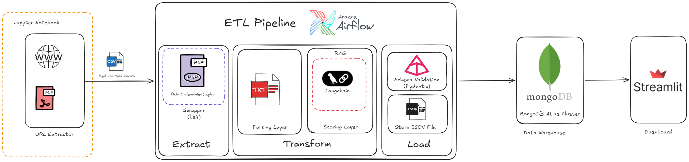
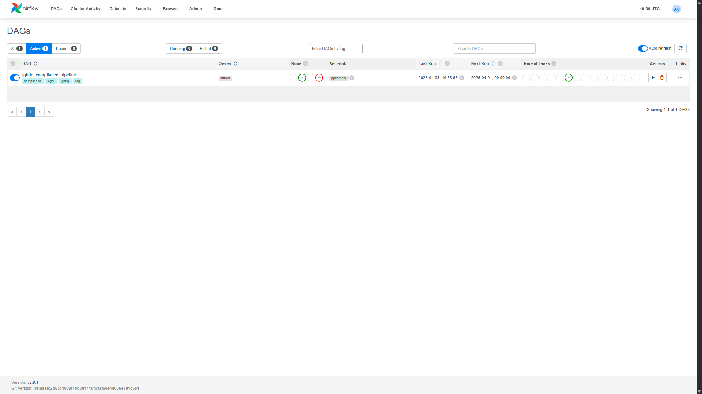
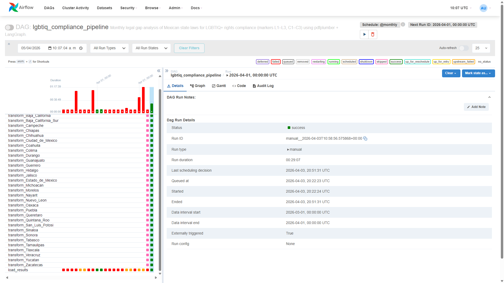
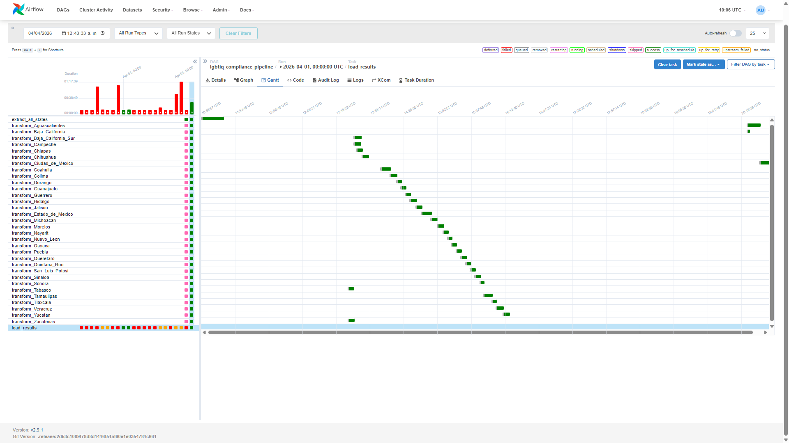
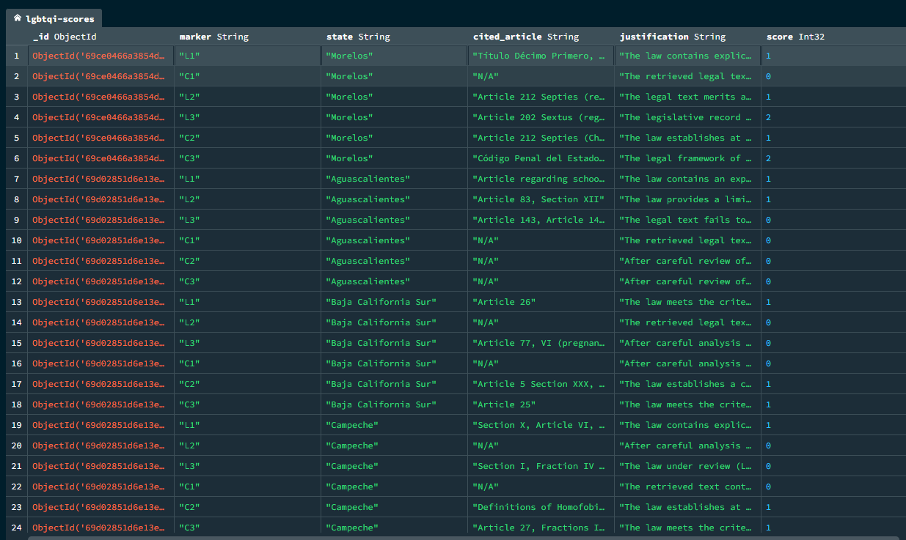
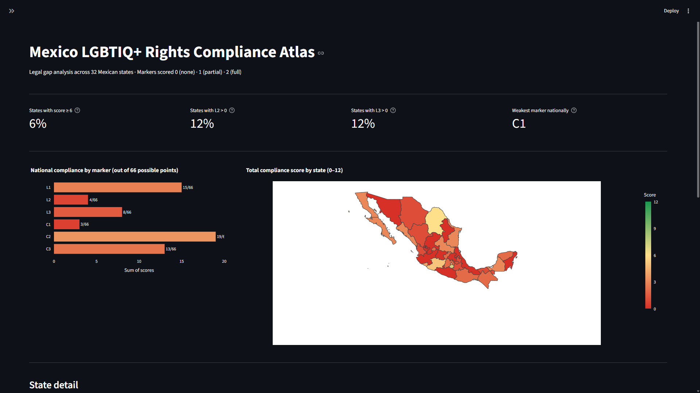
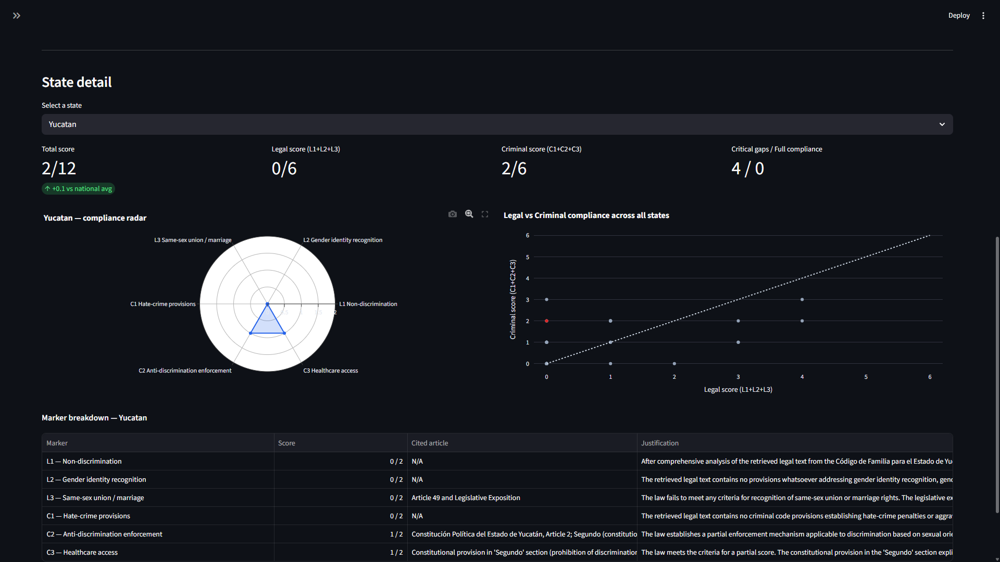
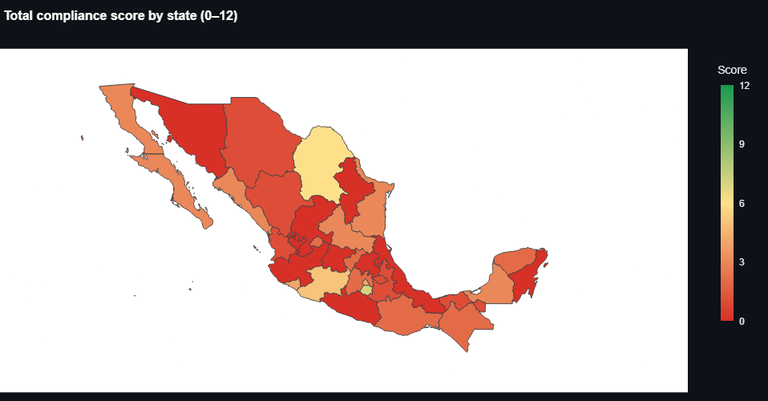
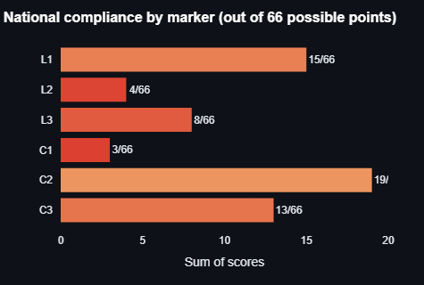

# Mexico LGBTIQ+ Rights Compliance Pipeline

A RAG-based NLP pipeline for automated legal gap analysis of Mexican state laws on LGBTIQ+ rights. The system evaluates compliance across all 32 Mexican states against six structured legal markers (L1–L3, C1–C3) using pdfplumber, LangGraph, and Claude, returning structured scores, justifications, and cited articles per state. Results are stored in MongoDB Atlas and visualized through an interactive Streamlit dashboard.

Part of the **Mexico Equality & Cyber Literacy Atlas** project.

---

## Table of Contents

- [Overview](#overview)
- [Compliance Markers](#compliance-markers)
- [Architecture](#architecture)
- [Pipeline](#pipeline)
- [Data Warehouse](#data-warehouse)
- [Dashboard](#dashboard)
- [Project Structure](#project-structure)
- [Setup & Running](#setup--running)
- [Notebooks](#notebooks)

---

## Overview

Mexican state laws are scraped from [ordenjuridico.gob.mx](http://www.ordenjuridico.gob.mx), extracted from PDF to text, and then scored against six LGBTIQ+ rights markers using a **devil's advocate LangGraph scoring graph**. Each marker is evaluated through a four-node graph:

```text
retrieve → challenge → rebut → verdict
```

- **retrieve** — finds the most relevant legal text chunks via FAISS vector search
- **challenge** — argues why the law *fails* to meet the marker criteria
- **rebut** — retrieves counter-evidence and rebuts each challenge
- **verdict** — weighs the challenge/rebuttal exchange and assigns a score of 0, 1, or 2

This adversarial design reduces hallucination and forces the model to justify both sides before reaching a conclusion.

---

## Compliance Markers

Each state is scored on six markers. Each marker receives a score of **0** (absent), **1** (partial), or **2** (full compliance), for a maximum total of **12 points** per state.

| Marker | Name                                                      | Score 1 (Partial)                                                                                | Score 2 (Full)                                                                                                      |
| ------ | --------------------------------------------------------- | ------------------------------------------------------------------------------------------------ | ------------------------------------------------------------------------------------------------------------------- |
| **L1** | Non-discrimination (sexual orientation / gender identity) | At least one explicit reference to sexual orientation OR gender identity as a protected category | Explicit prohibition of discrimination on BOTH axes across multiple domains with enforcement                        |
| **L2** | Legal gender-identity recognition                         | Any legal pathway for gender-identity recognition or name/gender-marker change                   | Full administrative (non-judicial, non-medical) procedure to change name and gender marker                          |
| **L3** | Same-sex union or marriage rights                         | Recognition of same-sex civil unions with at least some patrimonial rights                       | Explicit recognition of same-sex marriage with full equal rights                                                    |
| **C1** | Hate-crime / aggravated penalty provisions                | Sexual orientation or gender identity as an aggravating factor in at least one crime category    | Hate-crime provisions covering both axes across multiple crime types with enhanced penalties                        |
| **C2** | Anti-discrimination enforcement mechanism                 | At least one complaint or sanction mechanism applicable to LGBTIQ+ discrimination                | Specific independent enforcement body or formal administrative procedure with binding sanctions                     |
| **C3** | Healthcare access without discrimination                  | Prohibition of discrimination in healthcare on at least general terms                            | Equal healthcare access with specific provisions for gender-affirming care or conversion-practice bans              |

---

## Architecture

The pipeline follows a classic ETL pattern orchestrated by Apache Airflow, with MongoDB Atlas as the data store and Streamlit as the visualization layer.



**Stack:**

| Layer | Technology |
| --- | --- |
| Orchestration | Apache Airflow 2.9.1 (LocalExecutor, Docker) |
| PDF extraction | pdfplumber |
| Embeddings | `sentence-transformers/paraphrase-multilingual-MiniLM-L12-v2` (FAISS) |
| Scoring LLM | Claude (claude-sonnet-4-5) via LangChain + LangGraph |
| Data store | MongoDB Atlas |
| Dashboard | Streamlit + Plotly |
| Containerization | Docker Compose |

---

## Pipeline

### DAG structure

The Airflow DAG `lgbtiq_compliance_pipeline` runs monthly and has the following task structure:

```text
extract_all_states  →  [transform_Aguascalientes, ..., transform_Zacatecas]  →  load_results
```

- **extract_all_states** — scrapes all 32 states sequentially from ordenjuridico.gob.mx, extracts text with pdfplumber, saves `.txt` files to `data/raw/{state}/`
- **transform_{state}** — 32 parallel tasks (pool: `transform_pool`, 3 concurrent slots); each builds a FAISS vector store and runs the LangGraph scoring graph for 6 markers
- **load_results** — consolidates all 192 records, writes JSON to `data/output/`, upserts to MongoDB Atlas







### Pools

| Pool             | Slots | Purpose                                            |
| ---------------- | ----- | -------------------------------------------------- |
| `extract_pool`   | 3     | Limits concurrent web scraping                     |
| `transform_pool` | 3     | Limits concurrent FAISS + LLM tasks to avoid OOM   |

### XCom data flow

To stay within Airflow's 48 KB XCom limit, only **file paths** (not text content) are passed between tasks:

```text
extract_all_states  →  XCom: {state: ["/data/raw/state/file.txt", ...]}
transform_{state}   →  reads .txt files from disk, returns [{marker, score, ...}, ...]
load_results        →  pulls all 32 transform XComs, flattens to 192 records
```

---

## Data Warehouse

Results are stored in MongoDB Atlas with one document per `(state, marker)` pair, upserted on each pipeline run. Each document follows this schema:

```json
{
  "state":         "Yucatan",
  "marker":        "L2",
  "score":         1,
  "justification": "The law provides a limited legal pathway...",
  "cited_article": "Article 83, Section XII"
}
```



---

## Dashboard

The Streamlit dashboard reads from MongoDB Atlas (falling back to the latest `data/output/scores_*.json` if Atlas is unavailable) and provides:

### National view

- 4 KPI cards: % of states with total score ≥ 6, L2 coverage, L3 coverage, weakest marker nationally
- Horizontal bar chart: sum of scores per marker out of maximum possible points
- Choropleth map of Mexico: states colored by total score (red → yellow → green, 0–12)

### State detail panel

- Radar chart: 6-marker score profile for the selected state
- Scatter plot: Legal score (L1+L2+L3) vs Criminal score (C1+C2+C3) — selected state highlighted
- Per-state KPIs: total score vs national average, critical gaps (score = 0), full compliance (score = 2)
- Expandable detail table: Marker · Score · Cited Article · Justification









---

## Project Structure

```text
.
├── dags/
│   └── lgbtiq_compliance_dag.py        # Airflow DAG (extract → transform×32 → load)
├── tasks/
│   ├── extract.py                      # PDF scraping + pdfplumber extraction
│   ├── transform.py                    # FAISS + LangGraph devil's advocate scoring
│   └── load.py                         # JSON + MongoDB Atlas persistence
├── app/
│   └── main.py                         # Streamlit dashboard
├── notebooks/
│   ├── 01_inventory_scraper.ipynb      # Builds legal_inventory.csv
│   ├── 02_sample_extraction.ipynb      # Tests pdfplumber on sample PDFs
│   ├── 03_database_connection_test.ipynb  # MongoDB Atlas connectivity test
│   ├── 04_chunk_estimation.ipynb       # Token/cost projection
│   ├── 05_baja_california_fallback.ipynb  # Manual PDF extraction for BC
│   └── 06_baja_california_scoring.ipynb   # Manual scoring for BC
├── data/
│   ├── output/                         # Scores JSON + legal_inventory.csv
│   ├── raw/                            # Extracted .txt files per state
│   ├── morelos/                        # Fallback local PDFs for Morelos
│   └── fallback/                       # Manually downloaded PDFs for other states
├── config/
│   └── mongo.yaml                      # MongoDB Atlas connection config
├── scripts/
│   └── debug_ficha.py                  # Debug helper for ordenjuridico page structure
├── Dockerfile
├── docker-compose.yml
└── requirements.txt
```

---

## Setup & Running

### Prerequisites

- Docker Desktop
- An [Anthropic API key](https://console.anthropic.com/)
- A MongoDB Atlas cluster with a collection configured in `config/mongo.yaml`

### 1. Configure environment

Create a `.env` file at the project root:

```env
ANTHROPIC_API_KEY=[Use_your_own] 

POSTGRES_USER=airflow
POSTGRES_PASSWORD=airflow
POSTGRES_DB=airflow

AIRFLOW_FERNET_KEY=<generate with: python -c "from cryptography.fernet import Fernet; print(Fernet.generate_key().decode())">
AIRFLOW_SECRET_KEY=<any random string>
AIRFLOW_ADMIN_USER=admin
AIRFLOW_ADMIN_PASSWORD=admin
AIRFLOW_ADMIN_EMAIL=admin@example.com
```

### 2. Build and start

```bash
docker compose build --no-cache
docker compose up airflow-init    # one-time DB setup + pool creation
docker compose up -d              # start all services
```

Services:

| Service              | URL                                           |
| -------------------- | --------------------------------------------- |
| Airflow webserver    | <http://localhost:8080>                       |
| Streamlit dashboard  | <http://localhost:8501>                       |

### 3. Trigger the pipeline

From the Airflow UI, trigger `lgbtiq_compliance_pipeline` manually, or run a test via CLI:

```bash
docker compose exec airflow-scheduler \
  airflow dags test lgbtiq_compliance_pipeline 2025-01-01
```

### 4. Check pools

```bash
docker compose exec airflow-scheduler airflow pools list
```

---

## Notebooks

Run these in order for initial setup or to process fallback states manually:

| Notebook | Purpose |
| --- | --- |
| `01_inventory_scraper.ipynb` | Scrapes ordenjuridico.gob.mx and builds `data/output/legal_inventory.csv` |
| `02_sample_extraction.ipynb` | Validates pdfplumber extraction on a sample of documents |
| `03_database_connection_test.ipynb` | Tests MongoDB Atlas connectivity using `config/mongo.yaml` |
| `04_chunk_estimation.ipynb` | Estimates chunk counts and projects Claude API cost for the full run |
| `05_baja_california_fallback.ipynb` | Extracts text from manually downloaded Baja California PDFs |
| `06_baja_california_scoring.ipynb` | Runs scoring for Baja California and upserts results to Atlas |
